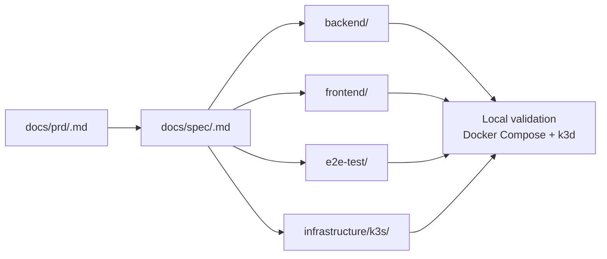

# PRD-Driven Delivery Workspace

This repo demonstrates how I structure docs-first delivery from product requirements to backend, frontend, QA, and local infrastructure validation.

It is not meant to be a large production clone. It is meant to show a working delivery model:

- start with a PRD
- refine it into a spec
- drive implementation across `backend`, `frontend`, and `e2e-test`
- validate the result locally with Docker and k3d

The core claim of this workspace is simple:

> one good product document should be able to drive one complete feature across multiple projects

## What This Repo Proves

- A feature can start in `docs/`, not in source code.
- Product requirements can be made explicit enough to drive API, UI, and test changes.
- The same feature can be validated both in local service mode and in a k3s-style environment.
- A single engineer can keep backend, frontend, QA, and infrastructure aligned through shared documents and conventions.

## Delivery Model



## Docs-First Rule

If you are using this workspace in an LLM-assisted or product-driven workflow, the first job is to write documents, not code.

That means:

1. Create a PRD in `docs/prd/`.
2. Turn it into an execution-facing spec in `docs/spec/`.
3. Use those documents as the handoff for implementation in `backend`, `frontend`, and `e2e-test`.

The product-side contribution in this repo is the document package. The code should follow the documents, not lead them.

## How To Make A Feature

1. Create a new PRD file under `docs/prd/`.
2. Describe the user problem, goals, non-goals, and product rules.
3. Add or update a spec file under `docs/spec/`.
4. In the spec, define the backend contract, validation rules, UI states, and acceptance criteria.
5. Call out the exact project touchpoints:
   `backend`, `frontend`, `e2e-test`, and `infrastructure` if deployment or ingress behavior changes.
6. Use the PRD and spec together as the feature handoff.

Current documentation examples:

- PRD: [`docs/prd/task-lifecycle-and-status-rules.md`](/Users/skshim/git/side-project/example-workspace/docs/prd/task-lifecycle-and-status-rules.md)
- Spec: [`docs/spec/task-lifecycle-and-status-rules.md`](/Users/skshim/git/side-project/example-workspace/docs/spec/task-lifecycle-and-status-rules.md)

## Workspace Shape

| Path | Role |
|------|------|
| `docs/prd/` | Product requirements |
| `docs/spec/` | Execution-facing feature specs |
| `backend/` | Kotlin + Spring Boot API |
| `frontend/` | Vue 3 + Vite web app |
| `database/` | Local MariaDB runtime and bootstrap SQL |
| `e2e-test/` | Playwright smoke and UI verification |
| `infrastructure/` | k3s/k3d-oriented Dockerfiles, Helm templates, and scripts |

## Quick Start

```bash
cd ~/git/side-project/example-workspace

# 1) database
make db-up

# 2) backend
make backend-run

# 3) frontend
cd frontend
corepack pnpm install
corepack pnpm dev

# 4) e2e smoke
cd ../e2e-test
corepack pnpm install
corepack pnpm test
```

## Local Validation

This workspace has been validated on Apple Silicon with Docker Desktop by running k3s through `k3d`.

```bash
# create or switch the local cluster
make k3d-up

# build local images and deploy the Helm release
make helm-deploy-local

# verify backend, frontend, nginx, and database together
make helm-smoke-local

# open the cluster entrypoint
open http://127.0.0.1:8088
curl -H "Host: example-workspace.local" http://127.0.0.1:8088/api/health
```

## Workspace Commands

```bash
make help
make db-up
make backend-run
make backend-logs
make backend-test
make frontend-dev
make e2e-test
make k3d-up
make helm-template
make helm-deploy-local
make helm-smoke-local
```

## Why This Exists

Many repos show either:

- a product document with no credible execution path, or
- application code with no clear product reasoning behind it

This workspace is for the space in between.

It exists to show how a feature can move through:

- product intent
- implementation detail
- API and UI impact
- QA coverage
- local environment verification

without losing the thread between those layers.
