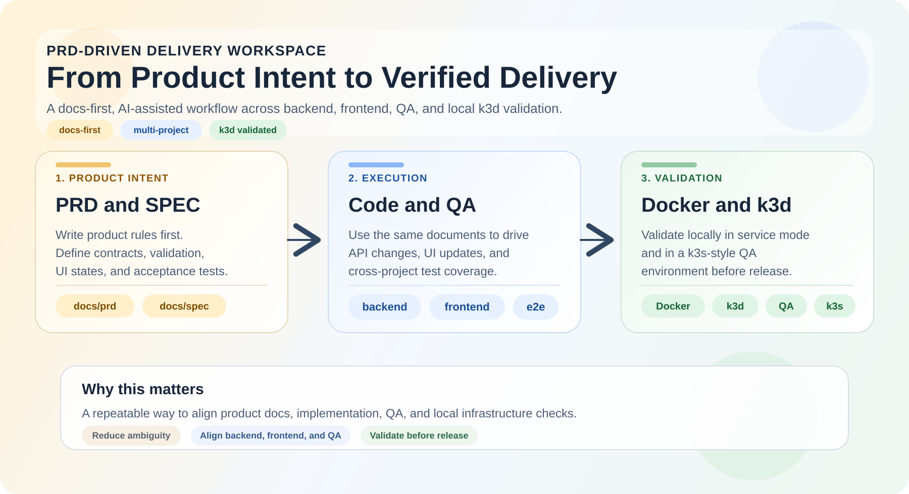
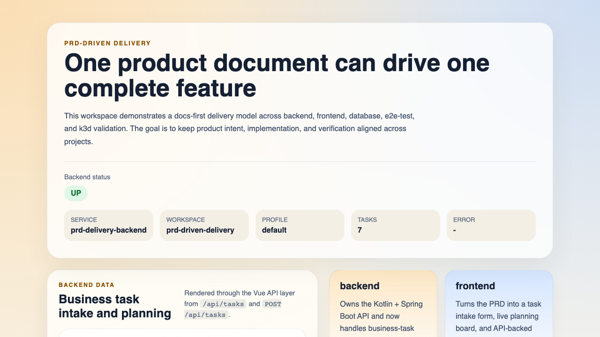
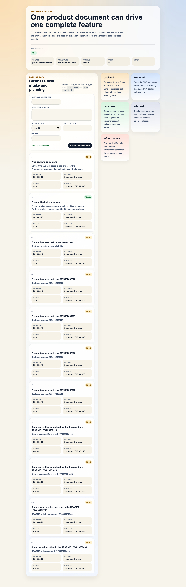
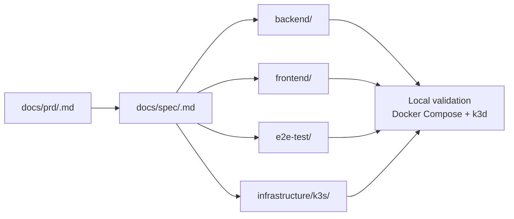

# PRD-Driven Delivery Workspace

This repo demonstrates how I structure docs-first delivery from product requirements to backend, frontend, QA, preview environments, and local infrastructure validation.

It is not meant to be a large production clone. It is meant to show a working delivery model:

- start with a PRD
- refine it into a spec
- drive implementation across `backend`, `frontend`, and `e2e-test`
- validate the result locally with Docker and k3d
- expose branch or pull-request previews so reviewers can judge the running result, not just the diff
- use AI assistance inside that structured workflow instead of treating AI output as the workflow itself

The core claim of this workspace is simple:

> one good product document should be able to drive one complete feature across multiple projects



## What This Demonstrates

- A feature can start in `docs/`, not in source code.
- Product requirements can be made explicit enough to drive API, UI, and test changes.
- The same feature can be validated both in local service mode and in a k3s-style environment.
- Preview URLs can be generated deterministically from a branch or pull request and cleaned up after merge.
- A single engineer can keep backend, frontend, QA, and infrastructure aligned through shared documents and conventions.
- AI-assisted workflows can be useful when they are grounded in explicit PRDs, specs, contracts, and validation steps.

## Demo

This repo runs as a working stack, not just as documentation.

- Backend API serves live health and task data from the Spring Boot service.
- Frontend consumes `/api/health` and `/api/tasks` through the Vue API layer.
- Playwright smoke tests cover both API and UI paths.
- The same stack is validated in a local `k3d` cluster through the Helm chart.
- Preview environments can be derived from a branch or pull request so reviewers can open a live URL instead of inferring the result from a diff.
- Local preview rehearsals expose direct browser URLs and a small dashboard for observing active previews.



<a href="docs/assets/frontend-task-created-demo.png">
  
</a>

Click the task-creation image to open the full-resolution screenshot.

## Impact

- Reduces ambiguity between product and engineering by keeping feature intent explicit in PRDs and specs.
- Enables deterministic execution across backend, frontend, and QA with one shared feature package.
- Improves QA reproducibility by validating the same slice locally and in an isolated `k3d` environment.
- Increases individual engineer leverage through structured, AI-assisted workflows instead of ad hoc generation.

## Currently Implemented

The current codebase proves the delivery path with a small working slice:

- `GET /api/health`
- `GET /api/tasks`
- `POST /api/tasks` with validated business planning fields
- Vue rendering of live backend health, business-task intake, and planning-oriented task rows
- Playwright smoke coverage for API health, API task reads, API task creation, and UI create/read paths
- Local Docker and `k3d` validation through the Helm chart
- branch or PR-based preview-environment scripts plus GitHub Actions wiring for deploy, comment, merge approval, and cleanup
- local preview URLs on `.localhost` plus dashboard generation for observing active previews

## Documented Next Feature

The task lifecycle package under `docs/` is intentionally the next planned implementation step, not a claim that it already exists in code.

- constrained status transitions via `PATCH /api/tasks/{id}`
- lifecycle rules layered on top of the existing task intake flow
- `blockedReason` validation and UI treatment
- richer task lifecycle e2e scenarios
- Liquibase schema expansion for `blocked_reason` and `updated_at`

## Why This Matters

Modern teams lose time translating intent into implementation.

This workspace demonstrates a structured way to:

- reduce ambiguity between product and engineering
- make backend, frontend, and QA changes easier to coordinate
- keep AI assistance inside a deterministic workflow instead of using it as an unstructured code generator
- validate the same feature in both local service mode and a k3s-style environment

The goal is not to claim “AI replaces engineering.” The goal is to show how one engineer can use structure, documentation, and automation to increase delivery leverage.

## Delivery Model



## Docs-First Rule

If you are using this workspace in an LLM-assisted or product-driven workflow, the first job is to write documents, not code.

That means:

1. Create a PRD in `docs/prd/`.
2. Turn it into an execution-facing spec in `docs/spec/`.
3. Use those documents as the handoff for implementation in `backend`, `frontend`, and `e2e-test`.

The product-side contribution in this repo is the document package. The code should follow the documents, not lead them.

## Role of AI in This Workflow

AI is not used here as a replacement for product thinking, engineering judgment, or QA.

Instead, it is used to:

- accelerate translation from PRD to spec to implementation tasks
- help keep backend, frontend, and e2e work aligned
- reduce repetitive drafting around contracts, acceptance criteria, and scaffolding

The constraint is deliberate: AI operates inside documents, tests, and environment checks. The source of truth stays in the PRD, spec, code review, and verification steps.

The supporting note for that workflow lives in [`docs/ai-workflow.md`](docs/ai-workflow.md).

## How To Make A Feature

1. Create a new PRD file under `docs/prd/`.
2. Describe the user problem, goals, non-goals, and product rules.
3. Add or update a spec file under `docs/spec/`.
4. In the spec, define the backend contract, validation rules, UI states, and acceptance criteria.
5. Call out the exact project touchpoints:
   `backend`, `frontend`, `e2e-test`, and `infrastructure` if deployment or ingress behavior changes.
6. Use the PRD and spec together as the feature handoff.

Current documentation examples:

- Implemented business-task slice: [`docs/prd/business-task-intake-and-planning.md`](docs/prd/business-task-intake-and-planning.md) and [`docs/spec/business-task-intake-and-planning.md`](docs/spec/business-task-intake-and-planning.md)
- Implemented preview-delivery slice: [`docs/prd/pull-request-preview-environments.md`](docs/prd/pull-request-preview-environments.md) and [`docs/spec/pull-request-preview-environments.md`](docs/spec/pull-request-preview-environments.md)
- Planned implementation slice: [`docs/prd/task-lifecycle-and-status-rules.md`](docs/prd/task-lifecycle-and-status-rules.md) and [`docs/spec/task-lifecycle-and-status-rules.md`](docs/spec/task-lifecycle-and-status-rules.md)

## Workspace Shape

| Path | Role |
|------|------|
| `docs/prd/` | Product requirements |
| `docs/spec/` | Execution-facing feature specs |
| `backend/` | Kotlin + Spring Boot API |
| `frontend/` | Vue 3 + Vite web app |
| `database/` | Local MariaDB runtime and bootstrap SQL |
| `e2e-test/` | Playwright smoke and UI verification |
| `infrastructure/` | k3s/k3d-oriented Dockerfiles, Helm templates, and scripts |

## Quick Start

```bash
git clone https://github.com/plainOldCode/prd-driven-delivery.git
cd prd-driven-delivery

# 1) database
make db-up

# 2) backend
make backend-run

# 3) frontend
cd frontend
corepack pnpm install
corepack pnpm dev

# 4) e2e smoke
cd ../e2e-test
corepack pnpm install
corepack pnpm test
```

## Local Validation

This workspace has been validated on Apple Silicon with Docker Desktop by running k3s through `k3d`.

```bash
# create or switch the local cluster
make k3d-up

# build local images and deploy the Helm release
make helm-deploy-local

# verify backend, frontend, nginx, and database together
make helm-smoke-local

# open the cluster entrypoint
open http://127.0.0.1:8088
curl -H "Host: prd-driven-delivery.local" http://127.0.0.1:8088/api/health
```

Preview rehearsal uses the same scripts as the PR workflow:

```bash
make pr-env-create-local PREVIEW_PR_NUMBER=204
make pr-env-test PREVIEW_PR_NUMBER=204
make pr-env-dashboard-open
make pr-env-delete PREVIEW_PR_NUMBER=204
```

## Preview Flow

Preview is treated here as part of delivery, not as an infra afterthought.

- Each preview is derived from a branch name or pull-request number.
- The preview namespace, release name, host, and URL are computed deterministically.
- Local preview rehearsals use `k3d` plus direct `.localhost` URLs for fast visual checks.
- A small dashboard shows active previews, readiness, and direct links.
- When a pull request is approved and merged, the preview environment is expected to be removed as part of the same workflow.

## Workspace Commands

```bash
make help
make db-up
make backend-run
make backend-logs
make backend-test
make frontend-dev
make e2e-test
make k3d-up
make helm-template
make helm-deploy-local
make helm-smoke-local
make pr-env-create-local PREVIEW_PR_NUMBER=204
make pr-env-test PREVIEW_PR_NUMBER=204
make pr-env-dashboard-open
make pr-env-delete PREVIEW_PR_NUMBER=204
```

## Why This Exists

Many repos show either:

- a product document with no credible execution path, or
- application code with no clear product reasoning behind it

This workspace is for the space in between.

It exists to show how a feature can move through:

- product intent
- implementation detail
- API and UI impact
- QA coverage
- local environment verification

without losing the thread between those layers.
